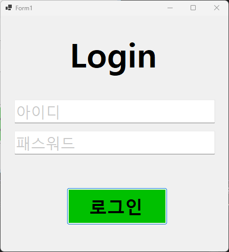
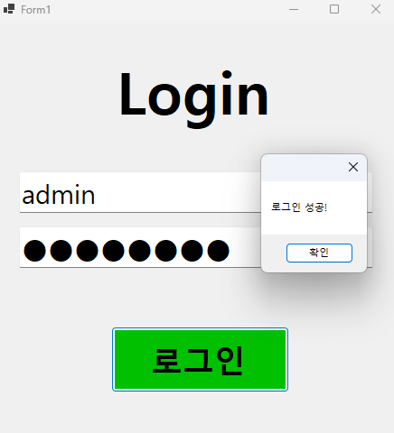
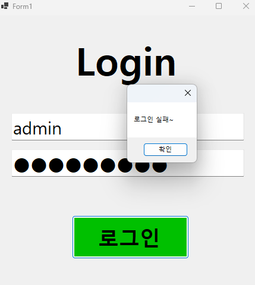

# (C# 코딩) 로그인 스크린

## 개요
- C# 프로그래밍 학습
- 1줄 소개 : 사용자로부터 아이디와 비밀번호를 입력 받아서 진행하는 로그인 프로그램 입니다.
- 사용한 플랫폼:
    - C#, .NET Windows Forms, Visual Studio, GitHub
- 사용한 컨트롤:
    - Label, TextBox_1, TextBox_2, Button
- 사용한 기술과 구현한 기능:
    - Visual Studio를 이용하여 UI 구성
    - 비밀번호 입력시, 비밀번호를 검정색 원으로 가리는 기능 구현
    - Tab 입력시 자동으로 다른 버튼(또는 텍스트 박스)로 넘어가는 기능 구현

---

## 실행 화면 (과제1)
- 과제1 코드의 실행 스크린샷

### 과제 내용
- Label(표시), TextBox(입력), Button(로그인)를 적절히 배치함
- Textbox에 Placeholder 기능을 구현함
- 아이디와 비밀번호를 입력 받아 검증함

### 구현 내용과 기능 설명
- 로그인 버튼 클릭 시 TextBox의 아이디나 비밀번호가 지정된 것이 맞는지 검증함
- Tab 입력시 자동으로 다른 버튼(또는 텍스트 박스)로 넘어가는 기능 구현함
- 비밀번호 입력시, 비밀번호를 검정색 원으로 가리는 기능 구현
- 아이디와 비밀번호 입력을 안할 때, 회색 글자로 아이디와 비밀번호 표시가 나오게 구현
